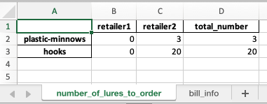

# Online purchase optimizer


# Intro
Have you ever online shopped and tried to decide: is it better to buy my items from retailer 1, retailer 2, retailer 3, ... or split my order between them?  Dividing an order amongst retailers can allow you to capitalize on cheaper prices for certain goods at some retailers, but it can increase your shipping costs. What's the optimal way to split a purchase across retailers to minimize the total bill? This program solves that problem (using linear integer programming).

This program was created as a fun way demonstrate the power and flexibility of linear programming to solve useful problems. 

## Problem Description

This program applies to the following very common online retail situation:
1. You are purchasing 1 or more (integer) quantities of several different products.
1. There are multiple online retailers selling the products.
1. Prices of items are (generally) different at different retailers.
1. Shipping prices are (generally) different at different retailers.
1. If your subtotal at a retailer reaches a threshold, you qualify for free shipping. Thresholds (generally) differ between retailers.

You must decide how many (integer) units of each item to order from each retailer, so that your total bill is minimized. (In other words, you decide how to divide your order amongst retailers, to minimize the total price.)  Your bill can be reduced by taking full advantage of cheaper shipping and cheaper unit prices.  

## Solution

The file [retailoptimizer.py](retailoptimizer.py) provides reusable code to solve this problem. Inside, it is using the [
Pulp](https://coin-or.github.io/pulp/) libary to solve a linear integer program to minimize the bill.

The notebook [Notebook.ipynb](Notebook.ipynb) provides examples of using the code.

There are two interfaces available to input data to specify an order to optimize:
1. An Excel spreadsheet. Use this if you want to quickly specify and solve your own retail optimization problems. Example Excel files are included in the [examples](examples) folder, and a detailed explanation is given in [docs/EXCEL.md](docs/EXCEL.md).
1. Python code. Use this to develop your own custom programs.

# Change Log
* Created [google colab](https://colab.research.google.com/github/mgalbright/online_purchase_optimizer/blob/main/Notebook.ipynb) notebook.
* Migrated the project to a python package that is pip-installable. Made Conda usage optional.

# Testing without Installation:
If you want to quickly test the library without installing anything on your computer, you can run the Notebook.py file in [google colab](https://colab.research.google.com/github/mgalbright/online_purchase_optimizer/blob/main/Notebook.ipynb).

# Installation:

## No cloning
If you just want to install the python package, but not the tests, you can install the package without cloning this repo:
1. Optional: Create a separate Conda environment: 
   ```shell
   conda create -y -n pulp python=3.11
   conda activate pulp
   ```
1. Install package
   ```shell 
   pip install git+https://github.com/mgalbright/online_purchase_optimizer
   ```

You can now access the library as demonstrated in the [google colab](https://colab.research.google.com/github/mgalbright/online_purchase_optimizer/blob/main/Notebook.ipynb) notebook.

## Cloning
If you want access to the pytest tests, clone this repo and install like this:
1. Clone this repo and cd inside
1. (Optional): Create a separate Conda environment named pulp to contain the installed libraries:
   ```shell
   conda create -y -n pulp python=3.11
   conda activate pulp
   ```
1. Install this page
   ```shell
   pip install -e .
   ```
1. Run unit tests to verify that the program is working correctly
   ```shell
   pytest tests/test_optimize.py
   ```


After cloning the repo, you can:

### Solve optimization problems via command line interface
If you have cloned the repo, you can use the command line interface to solve optimization problems:

1. Optionally, edit the file [examples/sample-order-small.xlsx](examples/sample-order-small.xlsx). (You can also make a copy and fill in your own problem parameters.)
1. Solve the problem:
   ```shell
   python ./src/online_purchase_optimizer/retailoptimizer.py -i examples/sample-order-small.xlsx -o examples/sample-order-small_results.xlsx
   ```

In the generated output file [examples/sample-order-small_results.xlsx](examples/sample-order-small_results.xlsx), you will find the solution. In this case, the optimal solution is to order all items from Retailer2, and order nothing from Retailer1.  


For more details, and a more complex example where the order is divided between retailers, read the supplemental documentation [docs/EXCEL.md](docs/EXCEL.md).

### Solve via Jupyter Notebook
See the notebook [Notebook.ipynb](Notebook.ipynb) for further examples of using the code to optimize retail orders.
1. Install jupyter lab if you don't have it
   ```shell
   pip install jupyterlab
   ```
1. Start jupyter lab:
   ```shell
   jupyter lab
   ```
1. Open [Notebook.ipynb](Notebook.ipynb) and run all cells.

# Documentation
1. A detailed walkthrough of the longer sample problem is given in [docs/EXCEL.md](docs/EXCEL.md).
1. For further info about the math formulation of the problem (for math lovers only), see [docs/MATH.md](docs/MATH.md).

# References
To learn more about linear programming, check out the book "Operations Research: Applications and Algorithms" by Winston.

