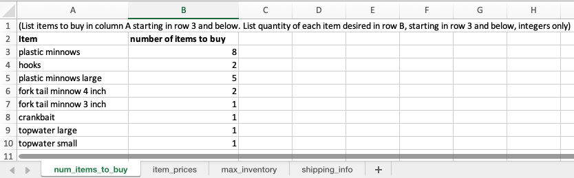
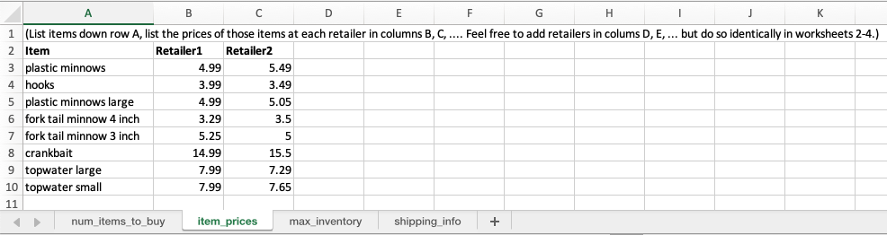
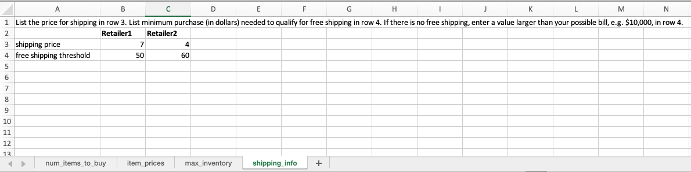
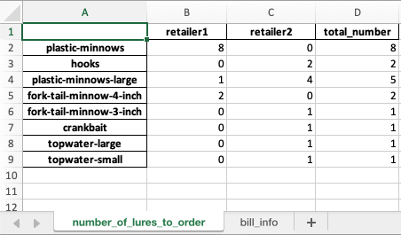
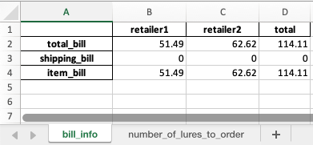

# Excel overview
This note walks through the longer example of entering data through excel, and reading the output from excel, using the included sample input file [sample-order-large.xlsx](../examples/sample-order-large.xlsx).

## Input
We start with the file [sample-order-large.xlsx](../examples/sample-order-large.xlsx). In this spreadsheet, the user must input the data that describes an online purchase they wish the make. The program will then read this data and find the optimal solution.   

In the first cell, we list the items we want to purchase in column A, and the number of each item to purchase in column B


In the second worksheet, the user lists the price of each item at each retailer.
(If an item is not sold by a retailer, you can invent a price and set the inventory to zero in the next step.)


In the third sheet, the user should list the max inventory, i.e. the maximum number of items a retail has in stock. If there is no limit, just insert a value larger than the desired number of items, e.g. 100.  If a retailer does not sell an item, enter 0 for the inventory, as we do for the 'topwater large' lure and Retailer1.


In the fourth and final sheet, the user enters shipping costs. Row 3 lists the regular
price for shipping. Row 4 lists the minimum order price that qualifies for free shipping.


## Solving
You can then find the optimal solution to this problem with the code
```shell
python retailoptimizer.py -i examples/sample-order-large.xlsx -o examples/sample-order-large_results.xlsx
```

## Output solution
The result of the prior command is stored in the file [examples/sample-order-large_results.xlsx](../examples/sample-order-large.xlsx).  

The first sheet lists the optimal solution to the problem -- it tells you how many lures to order from each retailer to minimize your bill.  
  

Interpretation: 
1. This means the cheapest solution is to order 8 packs of 'plastic minnows' from Retailer 1 and 0 from Retailer 2. That makes sense because Retailer1 is cheaper.
1. Order 2 packs of hooks from Retailer 2 and 0 from Retailer 1. That also makes sense because Retailer 2 ish cheaper.
1. Etc.

A few features of the solution are worth highlighting:
1. The 'topwater large' lure is ordered from Retailer2, since Retailer1 has 0 inventory for this lure. So it must be ordered from Retailer2.
1. 4 units of 'plastic minnows large' are ordered from Retailer2, since it has the cheaper price.  But 1 unit of 'plastic minnows large' is ordered from Retailer1, even though Retailer1 has a higher unit price, because this increases the bill at Retailer1 just enough to qualify for free shipping (eliminating a \$7 shipping fee), reducing the overall bill.

The second sheet gives further details for the purchase.  
   

The first row is shows the total bill, broken down by retailer. The second row shows shipping costs. We see in this scenario, no shipping is paid to either retailer.  We also see the bill for Retailer1 (\$51.49) was just above \$50 and qualified for free shipping. The third row shows the non-shipping costs of the items.